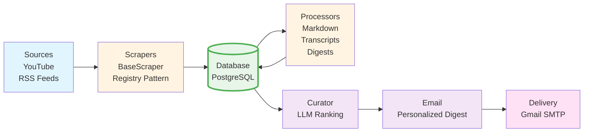

# AI News Aggregator

An intelligent news aggregation system that scrapes AI-related content from multiple sources (YouTube channels, RSS feeds), processes them with LLM-powered summarization, curates personalized digests based on user preferences, and delivers daily email summaries.

## Overview

This project aggregates AI news from multiple sources:
- **YouTube Channels**: Scrapes videos and transcripts from configured channels
- **RSS Feeds**: Monitors OpenAI and Anthropic blog posts
- **Processing**: Converts content to markdown, generates summaries, and creates digests
- **Curation**: Ranks articles by relevance to user profile using LLM
- **Delivery**: Sends personalized daily email digests

## Architecture

## How It Works

### Pipeline Flow

1. **Scraping** (`app/runner.py`)
   - Runs all registered scrapers
   - Fetches articles/videos from configured sources
   - Saves raw content to database

2. **Processing** (`app/services/process_*.py`)
   - **Anthropic**: Converts HTML articles to markdown
   - **YouTube**: Fetches video transcripts
   - **Digests**: Generates summaries using LLM

3. **Curation** (`app/services/process_curator.py`)
   - Ranks digests by relevance to user profile
   - Uses LLM to score and rank articles

4. **Email Generation** (`app/services/process_email.py`)
   - Creates personalized email digest
   - Selects top N articles
   - Generates introduction and formats content
   - Marks digests as sent to prevent duplicates

5. **Delivery** (`app/services/email.py`)
   - Sends HTML email via Gmail SMTP

### Daily Pipeline

The `run_daily_pipeline()` function orchestrates all steps:
- Ensures database tables exist
- Scrapes all sources
- Processes content (markdown, transcripts)
- Creates digests
- Sends email
- **feedparser**: RSS parsing
- **youtube-transcript-api**: Video transcripts
- **UV**: Package management
